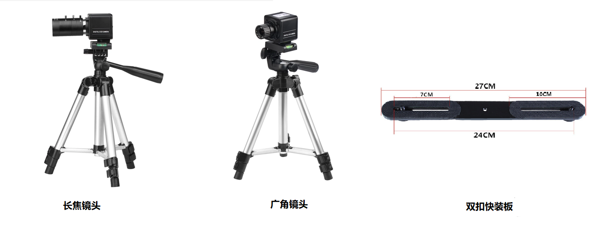

Evision 双目视觉系统

|分支|master|Evision_without_cuda|
|:------:|:------:|:------:|
|分支情况|全功能版|没有CUDA和目标检测的版本|
当前分支:Evision_without_cuda

Introduction:
=========
1. 双目测距 
2. 标定,畸变校正 
3. 三维点云获取 
4. 关于双目的中文资料重复度太高,希望各位后来者能够吸取前人精华,摒弃前人的糟粕,多多自行探索,不要抄来抄去 
5. 如果您对于Visual Studio和Qt Creater并不是十分熟悉,请务必仔细阅读本文档. 
6. 如果您需要安装依赖,请仔细阅读本文下方的安装指南,从官方网站下载安装包,并且不要按照其他形如"OpenCV和VS2017环境搭建"之类的教程进行所谓的环境配置. 
7. 项目中自带了OpenCV,请不要修改项目的"包含目录,库目录和附加依赖项"等项目,除非您非常清楚这些东西的意义. 
8. 关于程序使用方面的问题,可以联系邮件jiafeng5513@outlook.com,有关课程设计和毕业论文(Windows程序开发,机器视觉,深度学习,图像处理)也可以联系作者 
9. 当前分支是不含有CUDA和目标检测的版本,如果需要使用这些功能,请使用master分支. 

目录
=========
- [Introduction:](#introduction)
- [目录](#%E7%9B%AE%E5%BD%95)
      - [1.Dependencies](#1dependencies)
      - [2.Installation_guide](#2installationguide)
      - [3.Directory_specification](#3directoryspecification)
      - [4.Solutions_and_projects](#4solutionsandprojects)
      - [5.EvisionLegacy(C++/MFC版本)](#5evisionlegacycmfc%E7%89%88%E6%9C%AC)
      - [6.Evision(C++/Qt版本)](#6evisioncqt%E7%89%88%E6%9C%AC)
      - [7.CvLabMain和CvLabSandbox(C#版本)](#7cvlabmain%E5%92%8Ccvlabsandboxc%E7%89%88%E6%9C%AC)
      - [8.其他](#8%E5%85%B6%E4%BB%96)
      - [9.参考文献](#9%E5%8F%82%E8%80%83%E6%96%87%E7%8C%AE)
      - [10.部分框图](#10%E9%83%A8%E5%88%86%E6%A1%86%E5%9B%BE)

#### 1.Dependencies
1. Qt :5.12.0
2. OpenCV : 3.4.1
3. Visual Studio 2017

#### 2.Installation_guide

1. [Qt安装指南](./doc/Qt_Install.md) 
2. [VS2017安装指南](./doc/VS2017_Install.md) 
3. [VS2017-Qt配置指南](./doc/qt_vs_config.md) 

#### 3.Directory_specification
1. `data`文件夹存储测试用例 
2. `doc`文件夹中存储的是文档和文档中所用的图片等资源. 
3. `package`文件夹存储项目所需的依赖 
4. `scripts`文件夹存储编译脚本,由于使用了VisualStudio宏,这些脚本不能直接运行. 
5. `src`文件夹中存放工程目录和解决方案文件. 

#### 4.Solutions_and_projects
* 用VS2017打开`src/Evision.sln`,你将看到其中含有使用4个工程: 

1. EvisionLegacy是MFC版本的Evision主程序,生成目标是exe,已经停止更新,将会在未来的版本中移除. 
2. CustomGraphicsView是自定义QtDesigner插件,生成目标是dll和lib. 
3. Evision是Qt版的Evision主程序,生成目标是exe. 
* 用VS2017打开`src/CvLib.sln`,你将会看到两个工程: 

1. CvLabMain是用WPF框架写的. 
2. CvLabSandbox是用WinFrom写的. 

#### 5.EvisionLegacy(C++/MFC版本)
1. OpenCV版本:2.4.13,`package`文件夹中附带了该版本的OpenCV 
2. 依照[Installation guide (环境安装指南)](#2.Installation_guide)安装Visual Studio之后便可使用该项目. 
3. MFC版本已经停止更新,未来的版本中将会删除. 
4. [操作视频](https://www.bilibili.com/video/av8862669/) 

#### 6.Evision(C++/Qt版本)
1. Qt版本:Qt 5.12.0,请按照[Installation guide (环境安装指南)](#2.Installation_guide)进行安装. 
2. Vs版本:2017,请按照[Installation guide (环境安装指南)](#2.Installation_guide)进行安装. 
3. Opencv:3.4.1,`package`中已经附带了该版本的OpenCV,其他版本不保证能用. 
4. 带有编译脚本,可以自动将程序所需的dll复制到exe旁边,不需要设置环境变量. 
5. 下载使用时,请不要修改这个项目的VS项目设置,我已经考虑了移植问题,该项目的工程文件(vcproj)比较复杂,如果您不是很熟悉VS的操作,请务必不要修改. 
6. C++/Qt版本的程序更新活跃,未来的新功能会首先向该版本添加. 
7. 程序最多需要占用200MB内存. 
   
#### 7.CvLabMain和CvLabSandbox(C#版本)
1. Docking风格MDI界面 
2. 使用MVP设计模式,交互基于双向数据绑定 
3. VS2017,请按照[Installation guide (环境安装指南)](#2.Installation_guide)进行安装. 
4. 运行时为`.NET 4.6.1`,依赖采用Nuget下载 
5. packages:
    >1.AForge.2.2.5 
    >2.AForge.Video.2.2.5 
    >3.AForge.Video.DirectShow.2.2.5 
    >4.EMGU.CV.3.3.0.2824 
    >5.cskin.16.1.14.3 
    >6.WeifenLuo.WinFormsUI.Docking.2.1.0 
    >7.ZedGraph.5.1.5  
6. 该版本存在的目的是为了记录在C#平台上实现相似功能的方法,一般情况下不会更新. 

#### 8.其他
1. 作者所用的设备: 

#### 9.参考文献
1. [相机标定+畸变矫正](https://blog.csdn.net/Loser__Wang/article/details/51811347)
2. [StdoutRedirector](https://github.com/dbzhang800/StdoutRedirector)

#### 10.部分框图

