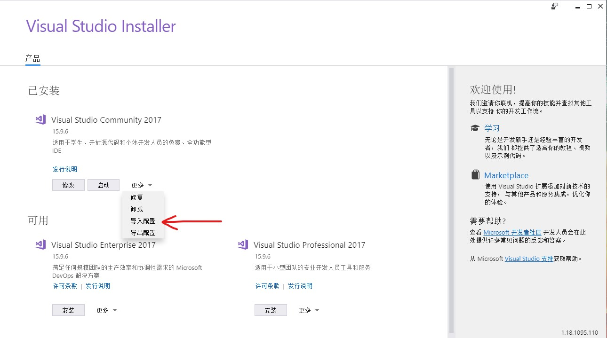

VS2017安装指南
=====================

1. VS2017只能安装到Windows 7以及更新版本的64位系统上,需要不少于40GB的C盘空余空间. 
2. 下载安装引导程序. 
[Visual Studio Community 2017 官网下载地址](https://visualstudio.microsoft.com/thank-you-downloading-visual-studio/?sku=Community&rel=15)
3. Community版本虽然是免费使用的,但是必须尽快登录自己的Microsoft账号,否则在大概一个月之后,你的Visual Studio授权将会过期无法使用.所以如果您没有微软账号,借此机会注册一个. 
4. 执行安装引导程序. 
5. **重要提示**`./doc/.vsconfig`文件中记载了作者使用的VS配置,如果您完全按照该配置单安装VS2017,可以尽可能的减少由于开发环境带来的问题,您可以下载该文件然后直接导入VS2017,以获得与作者相同的开发环境,导入方法见图   
6. 强烈建议将Visual Studio 安装到C盘.原因是即使你安装到别的分区,依然会有很大一部分组件必须安装到C盘,而这将会导致你的VS中的某些路径与其他人完全不同,这也许会引起一些不必要的麻烦.此外,如果您的C盘是固态磁盘驱动器,那么将会大幅度提高您的VS的打开和编译生成速度. 

7. 如果您以前使用过其他版本的VS,但是现在只想用最新版的,想彻底卸载掉旧版程序,推荐您使用微软官方的卸载工具: 
[旧版VS卸载工具](https://github.com/Microsoft/VisualStudioUninstaller/releases/download/v1.4/TotalUninstaller.zip)
以管理员权限执行其中的`Setup.ForcedUninstall.exe`,耐心等待程序运行完毕,即可干净的卸载旧版本的VS.注意,这个工具不能卸载VS2017.

8. 如果您想卸载VS2017,那么不用担心,只要在开始菜单中找到"Visual Studio Installer",运行他,就能看到卸载按钮,使用这个工具能够干净的卸载掉VS2017.
9. 如果您已经安装了其他版本的Visual Studio,并且由于某些原因不想安装Visual Studio 2017,您可以使用文本编辑器打开sln文件,手动修改其中我的版本号,便可以使用旧版本的VS,但是,作者强烈建议您使用最新版本的Visual Studio,以便于从作者处获取必要的帮助和支持,此举有助于控制变量,在作者帮助您调试或者解决问题时,能够减少不必要的麻烦.